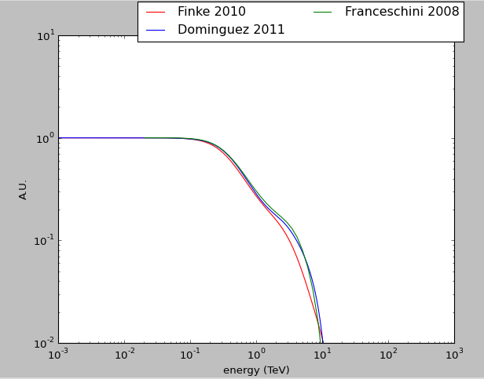

.. _EBL:

EBL Models
==========

The EBL module come from the ebltable git repository (see https://github.com/me-manu/ebltable)

Supported Models
----------------

Currently there is 5 models supported :

 * Franceschini, A., Rodighiero, G., & Vaccari, M.2008, A&A, 487, 837 . http://adsabs.harvard.edu/abs/2008A%26A...487..837F
 * Finke, Razzaque, & Dermer, 2010, ApJ, 712, 238 . http://adsabs.harvard.edu/abs/2009arXiv0905.1115F
 * Dominguez, A., Primack, J.R., Rosario, D. J., et al. 2011, MNRAS, 410, 2556 . http://adsabs.harvard.edu/abs/2011MNRAS.410.2556D
 * Inoue, Y., Inoue, S., Kobayashi, M. A. R., et al. 2013, ApJ, 768, 197 http://adsabs.harvard.edu/abs/2013ApJ...768..197I
 * Kneiske, T. M., & Dole, H. 2010, A&A, 515, A19  http://adsabs.harvard.edu/cgi-bin/bib_query?arXiv:1001.2132

Each model is read using

.. code-block:: python

    from ebltable.tau_from_model import OptDepth as OD
    tau = OD(model = 'inoue')
    # Source redshift
    z	= 0.2
    # array with energies in TeV
    ETeV = np.logspace(-1,1,50)

    # calculating the optical depth for a redshift z and TeV energies
    # this returns a two dimensional array with dimensions 
    # of the redshift array times dimensions of the energy array. 
    # Since z is a scalar here, it will return a 1 x 50 dim array.
    t = tau.opt_depth_array(z,ETeV)

Flux correction 
---------------

For correction of the flux, you can then compute

.. code-block:: python

    import numpy
    correction = numpy.exp(-1. * t[0])

Example 
-------
The example script can help to understand and will produce this plot

   Exemple of flux in A.U. corrected with the supported models. This plot has been generated by the 
   script ExempleEBL.py
