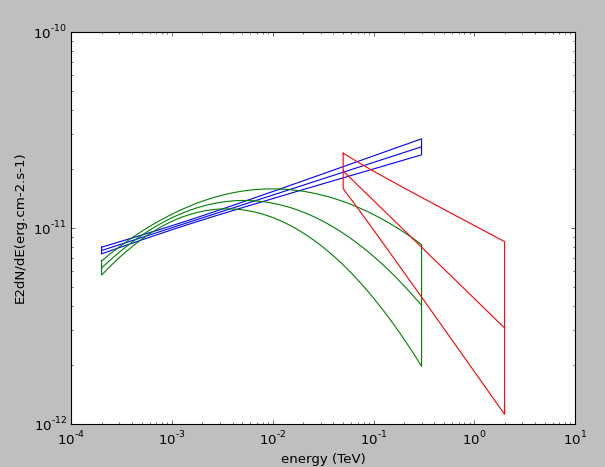

.. _FermiCatalog:

Catalog Reader
=============

Supported catalog
-----------------

Currently the catalogs that can be read are the 2FGL, the 3FGL, the 1FHL and the 2FHL. In the init script the location
of the Fits files is given as well as the version of the files. In Init_tools.sh, this is :

  * export VERSION_3FGL="16"
  * export VERSION_2FGL="09"
  * export VERSION_1FHL="07"
  * export VERSION_2FHL="08"

Code
----

A Catalog instance can be created using 

.. code-block:: python

    Cat = FermiCatalogReader(source,Folder = None,Representation = "e2dnde",escale = "TeV")

The usere need to provide :

    name    : catalog name of the source
    folder  : where the Fermi catalog are. If None, the FERMI_CATALOG_DIR environnement variable is used
    Representation : for the plot (dnde, ednde, e2dnde)
    escale  : energy scale in MeV, GeV or TeV

There is also the possiblity to declare a FermiCatalogReader based on a source name. This use the astropy module to resolve the named

.. code-block:: python
    source = "M 87"
    Cat = FermiCatalogReader.fromName(source,FK5,None,"e2dnde","TeV")

Capability
----------

Most of the information are in a dictionnary name CatalogData. The keys of this dictionnary are the catalog acronyms (2FGL, 3FHL, etc...)

This module can :

   * Provide the spectral model from a catalog using GetModel
   * Provide the source Class
   * Provide the source variability index
   * Provide the source position
   * Retrive the data point to plot them
   * Retrive the source model parameters
   * Be used to plot the spectral models

Example
-------

An exemple of the capability and how to use the code can be found un the exemple folder. The script is named ExReadFermiCatalog.py and will produce a nice plot with 3 catalog results and 

	
   2FGL, 3FGL and 2FHL butterfly from the Fermi catalog for the source 2FGL J1015.1+4925
